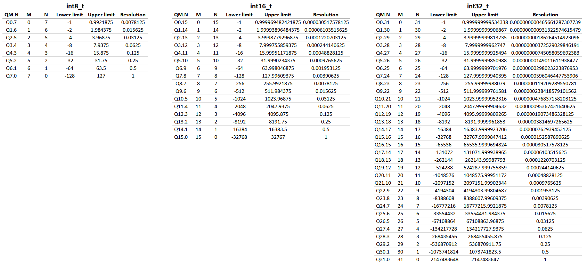

# fixed_point

This repository contains a type, scaled_int, that implements a signed fixed point number following the Q format.

scaled_int was developed to be compatible with c++98.

```c++
#define WITH_FLOAT_CONVERSION
#include <fixed_point/scaled_int.hpp>

int main() {
	using namespace fixed_point;

	typedef scaled_int<7, 8> scaled_int_7_8_t;
	typedef scaled_int<15, 16> scaled_int_15_16_t;

	typedef scaled_int_7_8_t::unscaled_float_type unscaled_float_7_8_t;

	scaled_int_7_8_t x(unscaled_float_7_8_t(0.125f));
	scaled_int_7_8_t y(unscaled_float_7_8_t(2.0f));

	scaled_int_15_16_t z = x * y;

	scaled_int_7_8_t q(z.convert<7,8>());

	return 0;
}
```
## Fixed point theory
See the excellent paper by Randy Yates http://www.digitalsignallabs.com/downloads/fp.pdf


## Choosing precision: Resolution and domain


## Alternatives
If you are able to use a more recent version of c++, I would choose one of the following libraries instead

 - MikeLankamp/fpm - [https://github.com/MikeLankamp/fpm](https://github.com/MikeLankamp/fpm)
 - Johnmcfarlane/cnl - [https://github.com/johnmcfarlane/cnl](https://github.com/johnmcfarlane/cnl)
 - mizevkov/fp - [https://github.com/mizvekov/fp](https://github.com/mizvekov/fp)

Another c++98 compatible library is coder-mike/FixedPoint - https://github.com/coder-mike/FixedPoint. Some inspiration was taken from coder-mike/FixedPoint when creating this library.
